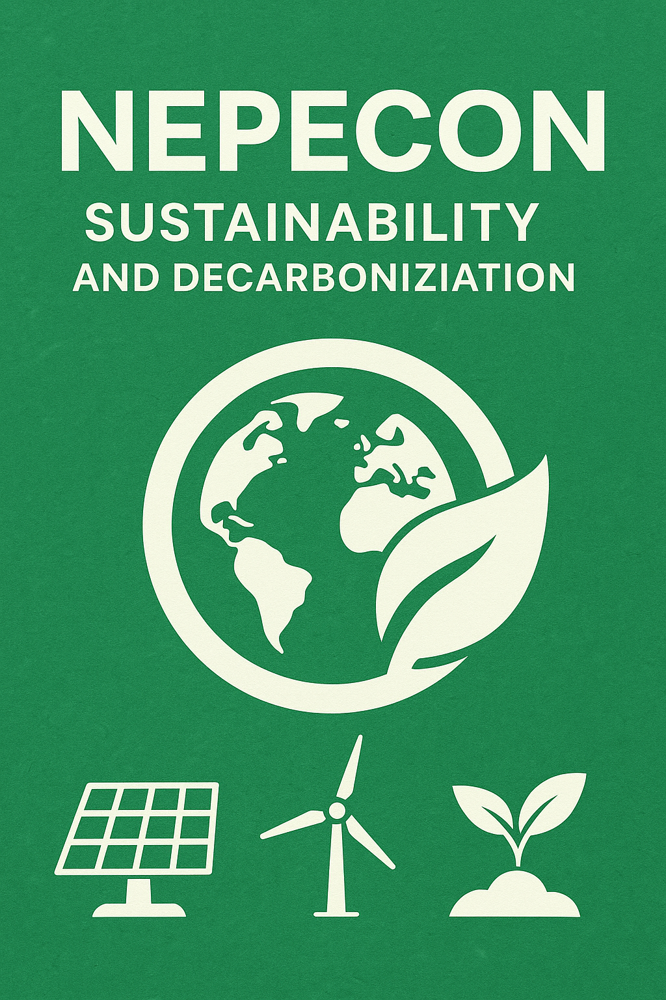

{ width=300 } 

NEPECON – Center for Studies and Research in Accounting and Socio-Environmental Sustainability (University of Brasília)

This repository organizes research materials, teaching resources, models, and technical references related to **Climate and Decarbonization Accounting**, including:

- IFRS S1 and IFRS S2  
- OCPC 10 (ESG Disclosure)  
- GHG Protocol (Scopes 1, 2 and 3)  
- ISO 14064  
- CBPS 01 and CBPS 02  
- REDD+, CBIO, MDL, Article 6  
- Climate risks and opportunities  
- Emissions measurement and carbon reporting  
- Carbon pricing and valuation models  
- Sustainable finance and climate governance frameworks  
- Brazilian and international taxonomies  
- Calculation templates and methodological models (Excel/Python)  

---

## 📂 Repository Structure
---

## 🎓 Purpose of this Repository

- Support the course **Contabilidade da Descarbonização – GESUNB/UAB**  
- Consolidate material for the **book under development**  
- Provide tools and methodologies for public and private institutions  
- Organize research outputs from NEPECON’s sustainability projects  
- Enable DOI attribution via Zenodo (versions and releases)  

---

## 🔗 Related Resources

- NEPECON YouTube Channel  
- NEPECON Research Network  
- Sustainability and Governance Projects (AGIR, LARA, DANI, Oráculo Cultural)

---

## 📎 Citation (coming soon)

A DOI will be generated after integrating this repository with Zenodo.
